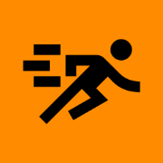

# dev-dash

---

## An unambitious developer dashboard for local development environments

_And yes, the logo looks like it's farting. Soz._

---

## Beta

This is very much in beta. It works for me, but your mileage may vary. 
Use at your own risk. It's not finished, and may have bugs. In fact, 
it almost certainly does.

It doesn't have instructions either, but if you want to look at the code,
you can probably figure it out. PRs not welcome yet, but feel free to
open issues. Actually, don't. Just stare at the logo some more.

It's not even finished. See below for the backlog of things to do...

-----
# Backlog
- [ ] Get rid of code setup, use appsettings.json or YAML - start with single-file .NET 10 thing

- [ ] Installable and/or CLI Tool version

- [ ] Colours in node/py/go app output?

- [ ] Standard start / url detection regexes

- [ ] Get rid of dead letters on restart (I think it's ProcessExited)

- [ ] Rework "RunStatus" to use current actor behaviour to report on status, 
rather separate status state in both supervisor and runner. Still use a timer, 
but handle it in each behaviour state and report based on that instead!

- [ ] OTel (although could just advise zipkin or similar exporter + 
configure URL to display in iframe?) (or even force some existing product
or something into dll)

- [ ] tilt-like view of compose, on new page

- [ ] Tests (Playwright)

- [ ] Packaging (ensure to include YAML.NET license)
-----

